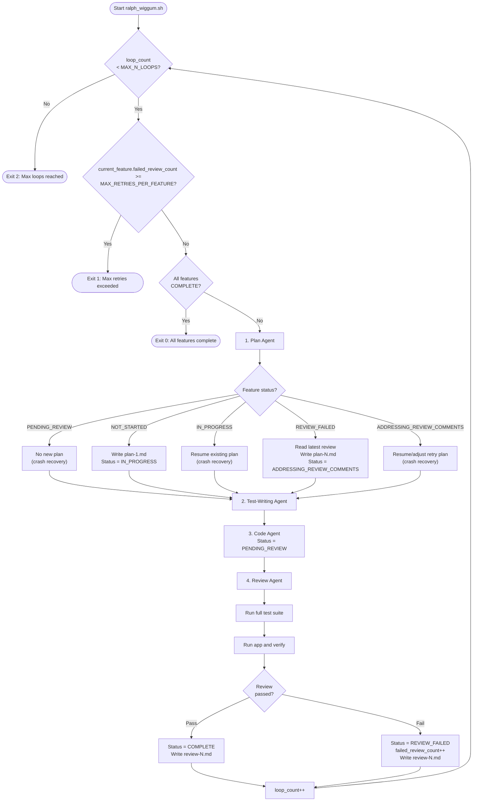

# Ralph Wiggum

The _Ralph Wiggum loop_ is an automated multi-agent loop for building complete applications on an isolated VM. Four specialised LLM agents (Plan, Test-writer, Code, Review) iterate through a pre-defined feature list, communicating through shared local files and git history.

Since the agents run in a VM (using lima-vm), they can basically do what they want without affecting your host system. However, be aware that we are not completely safe since they can still fetch from the web (e.g. using curl) and download malicious content.

The template for the application directory which the agents will work in is [./agent_harness_app_template/](./agent_harness_app_template/) (you make a copy of this directory, customise its starting state for your specific application, then this is the only folder your agents have access to).

The application directory contains a `.secret/` folder, which all agents are instructed to ignore in their prompts (i.e. it is a soft instruction for keeping their context window clean, not a security guardrail).

Currently, this process supports either cursor (CLI) or [opencode](https://github.com/anomalyco/opencode) for the agents.

For cursor, the model used by all agents (i.e. the default model) is specified in [`./agent_harness_app_template/.secret/cursor/cli-config.json`](./agent_harness_app_template/.secret/cursor/cli-config.json). If you wish to change this model, open cursor CLI agent and choose a new model using the `/model` command (this auto-populates your `~/.cursor/cli-config.json` with the correct "model" JSON you need for that model, and you can then copy that model config into this project).

For opencode, the model used by all agents (i.e. the default model) is specified in [./agent_harness_app_template/.secret/opencode/opencode.json](./agent_harness_app_template/.secret/opencode/opencode.json) (refer to the opencode docs for instructions on the correct schema for this file).

# The Agent Loop

Each iteration of the loop cycles through 4 agents in sequence, each with a fresh context window:

```
plan → write tests → code → review
```

Only one feature is worked on at a time. Agents cannot move to a new feature until the current feature reaches `COMPLETE` status. Each agent is briefly told what it's role is, which agent came before it and which agent will come after it.

Agents are all instructed to adhere to the requirements, goals, design and architecture described in the project docs.

All agents are instructed to update the project docs if their changes have caused the documentation to diverge from the codebase.

All agents commit their changes to git after completing their work.

## Shared Agent Pattern

All agents follow the same basic pattern:

1. Read required context before starting:
   - all project documentation (`README.md`, `docs/**/*`)
   - shared agent context files (`features_list.json`, `dev_notes.md`)
   - latest plan/review for the current feature (`docs/features/plans/<feature_id>/plan-<N>.md`, `docs/features/code_reviews/<feature_id>/review-<N>.md`)
   - recent git log (not full history)
2. `<agent-specific steps>`
3. Update project documentation.
4. Commit to git.

## 1. Plan Agent

Identifies which feature to work on by reading `features_list.json` and sets `"current_feature"` to the chosen feature ID.

Soft dependency gate (instruction-level, not script-enforced): the Plan agent is instructed not to start a new `NOT_STARTED` feature until all of that feature's `dependencies` are `COMPLETE`.

Feature selection follows this priority order:

1. **Crash recovery (pending review)** (feature_status=`PENDING_REVIEW`): A previous loop was interrupted after code was complete but before the review finished. The Plan agent does not write a new plan and leaves the feature status as `PENDING_REVIEW`.
2. **Crash recovery (first attempt)** (feature_status=`IN_PROGRESS`): A previous loop was interrupted mid-run. The Plan agent does not write a new plan unless the existing plan contains problems or is incomplete, and leaves the feature status as `IN_PROGRESS`.
3. **Crash recovery (retry attempt)** (feature_status=`ADDRESSING_REVIEW_COMMENTS`): A previous loop was interrupted while implementing review fixes. The plan agent does not write a new plan unless the existing plan is problematic or incomplete, leaving the feature status as `ADDRESSING_REVIEW_COMMENTS`.
4. **Retry kickoff** (feature_status=`REVIEW_FAILED`): Reads the latest code review (`docs/features/code_reviews/<feature_id>/review-<N>.md`). Writes a new plan version (`docs/features/plans/<feature_id>/plan-<N>.md`) and sets status to `ADDRESSING_REVIEW_COMMENTS`.
5. **First attempt** (feature_status=`NOT_STARTED`): Sets status to `IN_PROGRESS`. Writes a plan to `docs/features/plans/<feature_id>/plan-1.md`.

## 2. Test-Writing Agent

Writes tests based on the plan that the previous (Plan) agent just wrote (the latest `plan-<N>.md`).

- **First attempt**: Writes failing tests for the feature (TDD red phase).
- **Retry**: Reads the latest code review. May write additional tests if warranted, or leave existing tests unchanged.

## 3. Code Agent

Implements the latest plan, continuing to work on the code until all tests for the feature pass, then sets the feature status to `PENDING_REVIEW`.

- **Retry**: Reads both the latest plan and the latest code review before starting.

## 4. Review Agent

Before reviewing, the Review agent:

1. Runs the full test suite.
2. Runs the application and tries core functionality to verify it is (still) working.

**First review** of a feature: Checks the code against a predefined checklist. Checks are assessed by severity. Any failed check at medium severity or higher results in a failed review. Findings below medium severity may be cleaned up by the review agent or simply recorded in the review document and left alone if very low impact.

**Subsequent reviews** of the same feature: The code is assessed only against the explicit passing requirements listed in the previous review document (not the full checklist). If the code fails again, the new review document must again contain a (new) explicit list of requirements for passing.

The review is written to `docs/features/code_reviews/<feature_id>/review-<N>.md` regardless of pass/fail.

- **Pass**: Sets status to `COMPLETE`. Only the Review agent can mark a feature as `COMPLETE`.
- **Fail**: Sets status to `REVIEW_FAILED` and increments `failed_review_count` in `features_list.json` on the specific feature under review. The review document must be explicit about what must change to pass.

## Exit Conditions

You specify both MAX_N_LOOPS and MAX_RETRIES_PER_FEATURE when you start the agent loop.

The agent loop can terminate in one of four ways:

1. All features are marked as `COMPLETE`
2. Loop reaches MAX_N_LOOPS (all 4 agents is 1 loop).
3. A single feature reaches `failed_review_count >= MAX_RETRIES_PER_FEATURE` (early exit).
4. The code crashes (out of memory, CLI agent program crashes, any step returns non-zero exit code, unforseen system error etc.)

## Flowchart



All termination checks (`all features COMPLETE`, `current_feature.failed_review_count >= MAX_RETRIES_PER_FEATURE`, `loop count >= MAX_N_LOOPS`) are deterministic - `ralph_wiggum.sh` parses `features_list.json` with `jq`.

## Shared Context Model

Agents share context exclusively through local files and git history:

- `README.md` - all agents read the root `README.md` prior to starting their task. The `README.md` is an information-dense introduction (entrypoint) to the whole application, with instructions for running it, instructions for running the test suite, and links to other project documentation.
- `docs/**/*` - all agents read all project documentation in `/docs/` prior to starting their task.
- **`features_list.json`** - source of truth for what to work on and current status.
- **`docs/features/plans/<feature_id>/plan-<N>.md`** - versioned implementation plans.
- **`docs/features/code_reviews/<feature_id>/review-<N>.md`** - code reviews.
- **`dev_notes.md`** - optional append-only scratchpad for inter-agent notes (agents only write here if they have something genuinely useful to record, e.g. a design decision).
- **`git log`** - recent commit history provides a timeline of recent changes.

## `features_list.json` Schema

```json
{
  "current_feature": "F01",
  "all_features": [
    {
      "id": "F01",
      "name": "feature name here",
      "description": "feature description here",
      "status": "NOT_STARTED",
      "last_updated_at": "2026-02-21T12:54:26+00:00",
      "dependencies": [],
      "failed_review_count": 0
    }
  ],
  ...
}
```

| Field                 | Description                                                                                                       |
| --------------------- | ----------------------------------------------------------------------------------------------------------------- |
| `current_feature`     | ID of the feature currently being worked on                                                                       |
| `id`                  | Unique feature identifier (e.g. `F01`, `F02`)                                                                     |
| `name`                | Short human-readable name                                                                                         |
| `description`         | What the feature should do                                                                                        |
| `status`              | One of: `NOT_STARTED`, `IN_PROGRESS`, `PENDING_REVIEW`, `REVIEW_FAILED`, `ADDRESSING_REVIEW_COMMENTS`, `COMPLETE` |
| `last_updated_at`     | ISO 8601 timestamp of last status change                                                                          |
| `dependencies`        | List of feature IDs this feature depends on (if any)                                                              |
| `failed_review_count` | Number of failed reviews for the feature (starts at 0, incremented by Review agent on failure)                    |

## Feature Status Flow

| Status                       | Meaning                                            | Set by        |
| ---------------------------- | -------------------------------------------------- | ------------- |
| `NOT_STARTED`                | Queued for work                                    | Initial state |
| `IN_PROGRESS`                | Being worked on (first attempt)                    | Plan agent    |
| `PENDING_REVIEW`             | Code complete, feature tests pass, awaiting review | Code agent    |
| `REVIEW_FAILED`              | Review failed, will be retried in the next loop    | Review agent  |
| `ADDRESSING_REVIEW_COMMENTS` | Implementing fixes from latest review comments     | Plan agent    |
| `COMPLETE`                   | Review passed                                      | Review agent  |

# Running the Ralph Wiggum Loop

First, copy the project template into your own location:

```bash
cd ralph-wiggum/
cp -r agent_harness_app_template my-app-name # put it where you want your new codebase
```

This is now your project codebase (the VM doesn't allow your coding agents to see anything else).

Now, add the following documentation to your project:

1. **`README.md`** - project overview.
2. **`features_list.json`** - ordered list of discrete features to implement.
3. (optional) **`docs/PRD.md`** - Product Requirements Document defining what to build and why.
4. (optional) **`docs/architecture_design.md`** - Architecture Design Document defining **how** to build the application (architecture characteristics etc.).
5. (optional) Any other application documentation you like in `docs/` (every agents is instructed to read everything in `/docs/` before starting their task).

I highly recommend that you scaffold the folder layout (architecture) of your application, and document what each folder/file is for (and your architectural goals/patterns) in `README.md` (and/or `docs/architecture_design.md`) prior to starting the agent loop. Your coding agents are strongly instructed to adhere to your documentation, and a clearly defined (and documented) starting codebase architecture will hold back the floodgates of AI spaghetti code.
You may even wish to go so far as to fill in the module docstrings, and add stub functions, classes and methods etc. (i.e. define all of the interfaces prior to starting the agent loop).

While the loop is running, you can check progress of the main loop using `tail -f ralph_log.txt` or a specific agent log using `tail -f agent_logs/<filename>`.

Start the agent loop using the following commands:
(These steps assume that lima-vm is already installed)

```bash
# create the VM #
limactl create --name ralph --vm-type=qemu --containerd=system # default is ubuntu
limactl ls

# optional: if you need your CA certificates in the VM ==================== #
mkdir my-app-name/.secret/ca-certificates
cp /usr/local/share/ca-certificates/* my-app-name/.secret/ca-certificates
# ========================================================================= #

# start the VM #
limactl start ralph --mount-only ./my-app-name/:w  # only has read/write access to my-app-name/
limactl shell ralph

# start of commands run inside the VM ================================= #
sudo cp my-app-name/.secret/ca-certificates/* /usr/local/share/ca-certificates/ # only run if you copied in your CA certs earlier
sudo update-ca-certificates # only run if you copied in your CA certs earlier

bash my-app-name/.secret/environment_setup.sh cursor # setup environment for cursor-agent CLI
bash my-app-name/.secret/environment_setup.sh opencode # setup environment for opencode CLI
source ~/.bashrc # to get uv and opencode CLI commands to register

cd my-app-name
tree -a   # see the folder layout
git init
mkdir ~/.cursor # if using cursor
mv .secret/cursor/cli-config.json ~/.cursor  # if using cursor
mkdir ~/.config/opencode  # if using opencode
mv .secret/opencode/opencode.json ~/.config/opencode # if using opencode
uv python install 3.14
uv init
export OPENAI_BASE_URL='...' # if using opencode
export OPENAI_API_KEY='...' # if using opencode

# if using cursor, need to run this then log in to cursor: #
cursor-agent

bash ralph_wiggum.sh \
  # -l is maximum number of agent loops (1 loop = 4 agents)
  -l 20 \
  # -r is 'if a code review for the same feature fails more than this many times, this whole thing early exits'
  -r 3 \
  # -a is agent library - one of ['cursor', 'opencode']
  -a cursor \
  > ralph_log.txt

# exit codes of ralph_wiggum.sh:
#   0 = all features complete
#   1 = max review retries exceeded (early exit)
#   2 = maximum agent loops reached

# check token usage: #
opencode stats # if using opencode
# cursor doesn't expose token usage at this granularity (only in aggregate)

exit
# end of commands run inside the VM =================================== #

# delete the VM #
limactl stop ralph
limactl stop --force ralph  # if the previous one didn't work and you're angry
limactl delete ralph
```
