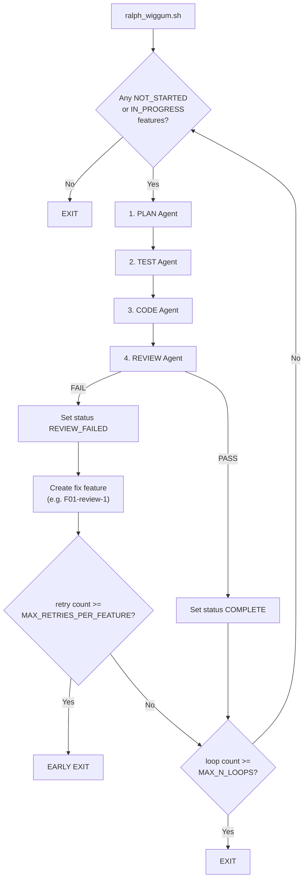

# Implementation of Ralph Wiggum

An automated multi-agent loop for building complete applications on an isolated VM. Four specialised LLM agents (Plan, Test, Code, Review) iterate through a pre-defined feature list, communicating through shared local files and git history.

Since the agents run in a VM (using lima-vm), they can basically do what they want without affecting your host system. However, be aware that we are not completely safe since they can still fetch from the web (e.g. using curl) and download malicious content.

The template for the application directory which the agents will work in is [./agent_harness_app_template/](./agent_harness_app_template/) (a copy of this directory is made, and this directory is all that the agents can see).

The application directory contains a `.secret/` folder, which all agents are instructed to ignore (in their prompts i.e. it is a soft instruction for context protection, not a guardrail).

You may use cursor (CLI) or opencode for the agents.

For cursor, the model used by all agents is specified in [./agent_harness_app_template/.secret/cursor/cli-config.json]. If you wish to change this model, open cursor CLI agent and choose a new model using the `/model` command (this auto-populates your ~/.cursor/cli-config.json with the correct "model" JSON you need for that model).

# The Agent Loop

Each iteration cycles through 4 agents (each new agent with a fresh context window):

```
plan → tests → code → review
```

| Agent      | Role                                                                                                                                                             | Key Responsibility                    |
| ---------- | ---------------------------------------------------------------------------------------------------------------------------------------------------------------- | ------------------------------------- |
| **Plan**   | Picks next unfinished feature from `features_list.json`, writes an implementation plan                                                                           | `docs/features/plans/<feature_id>.md` |
| **Tests**  | Writes failing tests from the plan (TDD red phase)                                                                                                               | Test files                            |
| **Code**   | Writes code to make tests pass (TDD green phase)                                                                                                                 | Application code, updates docs        |
| **Review** | Runs full test suite, evaluates last implemented feature against review checklist. Failed review is added as the next incomplete feature to `features_list.json` | `docs/code_reviews/<feature_id>/`     |



## Shared Context Model

Agents share context exclusively through local files and git history:

- **`features_list.json`** — source of truth for what to work on and current status.
- **`docs/features/plans/<feature_id>.md`** — implementation plans (append-only per feature).
- **`docs/code_reviews/<feature_id>/<N>-review.md`** — code review records.
- **`dev_notes.md`** — append-only scratchpad for inter-agent notes.
- **`git log`** — commit history provides a timeline of all changes.

## Feature Status Flow

| Status           | Meaning                                                            | Set by                |
| ---------------- | ------------------------------------------------------------------ | --------------------- |
| `NOT_STARTED`    | Queued for work                                                    | Initial project state |
| `IN_PROGRESS`    | Currently being worked on                                          | Plan agent            |
| `PENDING_REVIEW` | Feature code completed - all feature tests pass (not yet reviewed) | Coding agent          |
| `COMPLETE`       | Review passed                                                      | Review agent          |
| `REVIEW_FAILED`  | Review failed; a fix feature (e.g. `F01-review-1`) is created      | Review agent          |

When a review fails, the review agent creates a new fix feature with an ID like `F01-review-1`, containing the specific required changes. The retry count for early-exit is derived from the number of `<base_id>-review-*` entries in `features_list.json`.

# Running the Ralph Wiggum Loop

Prior to starting the agent loop, prepare the following documentation:

1. **`README.md`** — project overview
2. **`features_list.json`** — ordered list of discrete features to implement.
3. (optional) **`docs/PRD.md`** — Product Requirements Document defining what to build and why.
4. (optional) **`docs/architecture_design.md`** — Architecture Design Document defining how to build.

Then, start the agent loop using the following commands:
(These steps assume that lima-vm is already installed)

```bash
limactl create --name ralph --vm-type=qemu --containerd=system # default is ubuntu
limactl ls

cd ralph-wiggum/
cp -r agent_harness_app_template my-app-name

# optional: if you need your CA certificates in the VM ==================== #
mkdir my-app-name/.secret/ca-certificates
cp /usr/local/share/ca-certificates/* my-app-name/.secret/ca-certificates
# ========================================================================= #

limactl start ralph --mount-only ./my-app-name/:w  # only has read/write access to my-app-name/
limactl shell ralph

# start of commands run inside the VM ================================= #
sudo cp my-app-name/.secret/ca-certificates/* /usr/local/share/ca-certificates/ # only run if you copied in your CA certs earlier
sudo update-ca-certificates # only run if you copied in your CA certs earlier

bash my-app-name/.secret/environment_setup.sh cursor # if you want cursor-agent CLI
bash my-app-name/.secret/environment_setup.sh opencode # if you want opencode CLI
source ~/.bashrc # to get uv and opencode CLI commands to register

cd my-app-name
tree -a   # see the folder layout
sudo mv .secret/cursor/cli-config.json ~/.cursor  # if using cursor
mkdir ~/.config/opencode
sudo mv .secret/opencode/opencode.json ~/.config/opencode # if using opencode
uv python install 3.14
uv init
export OPENAI_BASE_URL='...' # if using opencode
export OPENAI_API_KEY='...' # if using opencode

bash ralph_wiggum.sh \
  -l 20 \ # maximum number of agent loops (4 agents run per loop)
  -r 3 \ # if a code review for the same feature fails more than this many times, the loop exits
  -a cursor # one of ['cursor', 'opencode']
# exit codes of ralph_wiggum.sh:
#   0 = all features complete
#   1 = max review retries exceeded (early exit)
#   2 = maximum agent loops reached

exit
# end of commands run inside the VM =================================== #

limactl stop ralph
limactl stop --force ralph
limactl delete ralph
```
