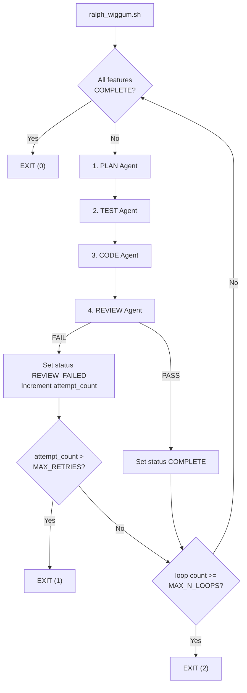

# Ralph Wiggum

An automated multi-agent loop for building complete applications on an isolated VM. Four specialised LLM agents (Plan, Test, Code, Review) iterate through a pre-defined feature list, communicating through shared local files and git history.

Since the agents run in a VM (using lima-vm), they can basically do what they want without affecting your host system. However, be aware that we are not completely safe since they can still fetch from the web (e.g. using curl) and download malicious content.

The template for the application directory which the agents will work in is [./agent_harness_app_template/](./agent_harness_app_template/) (a copy of this directory is made, and this directory is all that the agents can see).

The application directory contains a `.secret/` folder, which all agents are instructed to ignore (in their prompts i.e. it is a soft instruction for context protection, not a guardrail).

You may use cursor (CLI) or opencode for the agents.

For cursor, the model used by all agents is specified in [`./agent_harness_app_template/.secret/cursor/cli-config.json`](./agent_harness_app_template/.secret/cursor/cli-config.json). If you wish to change this model, open cursor CLI agent and choose a new model using the `/model` command (this auto-populates your `~/.cursor/cli-config.json` with the correct "model" JSON you need for that model).

# The Agent Loop

Each iteration of the loop cycles through 4 agents in sequence, each with a fresh context window:

```
plan → test → code → review
```

Only one feature is worked on at a time. Agents cannot move to a new feature until the current feature reaches `COMPLETE` status. Each agent is briefly told which agent it is, which agent came before it, and which agent comes after it.

All agents are instructed to update the project docs if their changes have caused the documentation to diverge from the codebase. All agents commit their changes to git after completing their work.

## 1. Plan Agent

Identifies which feature to work on by reading `features_list.json` and sets `"current_feature"` to the chosen feature ID. Feature selection follows this priority order:

1. **Crash recovery** (`IN_PROGRESS`): A previous loop was interrupted mid-run. The Plan agent resumes from the existing plan (does not re-plan from scratch unless the plan is missing or incomplete).
2. **Retry** (`REVIEW_FAILED`): Reads the latest code review (`docs/features/code_reviews/<feature_id>/review-<N>.md`). Writes a new plan version (`plan-<N>.md`, where N = `attempt_count`). Leaves status as `REVIEW_FAILED`.
3. **First attempt** (`NOT_STARTED`): Sets status to `IN_PROGRESS`. Writes a plan to `docs/features/plans/<feature_id>/plan-1.md`.

## 2. Test Agent

Writes tests based on the plan that the Plan agent just wrote (the latest `plan-<N>.md`).

- **First attempt**: Writes failing tests for the feature (TDD red phase).
- **Retry**: Reads the latest code review. May write additional tests if warranted, or leave existing tests unchanged.

## 3. Code Agent

Implements the plan until all tests for the feature pass, then sets the feature status to `PENDING_REVIEW`.

- **Retry**: Reads both the latest plan and the latest code review before starting.

## 4. Review Agent

Before reviewing, the Review agent must:

1. Read all relevant context docs and git log.
2. Run the full test suite.
3. Run the application and try basic functionality to verify it is working.

**First review** of a feature: Checks the code against a predefined checklist. Checks are assessed by severity. Any failed check at medium severity or higher results in a failed review. Findings below medium severity may be cleaned up by the review agent or simply recorded in the review document and left alone if very low impact.

**Subsequent reviews** of the same feature: The code is assessed only against the explicit passing requirements listed in the previous review document (not the full checklist). If the code fails again, the new review document must again contain an explicit list of requirements for passing.

The review is written to `docs/features/code_reviews/<feature_id>/review-<N>.md` regardless of pass/fail.

- **Pass**: Sets status to `COMPLETE`. Only the Review agent can mark a feature as `COMPLETE`.
- **Fail**: Sets status to `REVIEW_FAILED` and increments `attempt_count` in `features_list.json`. The review document must be explicit about what must change to pass.

## Flowchart



All termination checks (`all features COMPLETE`, `attempt_count > MAX_RETRIES`, `loop count >= MAX_N_LOOPS`) are deterministic — `ralph_wiggum.sh` parses `features_list.json` with `jq`.

## Shared Context Model

Agents share context exclusively through local files and git history:

- **`features_list.json`** — source of truth for what to work on and current status.
- **`docs/features/plans/<feature_id>/plan-<N>.md`** — versioned implementation plans.
- **`docs/features/code_reviews/<feature_id>/review-<N>.md`** — code review records.
- **`dev_notes.md`** — optional append-only scratchpad for inter-agent notes (agents only write here if they have something genuinely useful to record, e.g. a design decision).
- **`git log`** — commit history provides a timeline of all changes.

## `features_list.json` Schema

```json
{
  "current_feature": "F01",
  "all_features": [
    {
      "id": "F01",
      "name": "feature name here",
      "description": "feature description here",
      "status": "NOT_STARTED",
      "last_updated_at": "2026-02-21T12:54:26+00:00",
      "dependencies": [],
      "attempt_count": 1
    }
  ]
}
```

| Field             | Description                                                                         |
| ----------------- | ----------------------------------------------------------------------------------- |
| `current_feature` | ID of the feature currently being worked on                                         |
| `id`              | Unique feature identifier (e.g. `F01`, `F02`)                                       |
| `name`            | Short human-readable name                                                           |
| `description`     | What the feature should do                                                          |
| `status`          | One of: `NOT_STARTED`, `IN_PROGRESS`, `PENDING_REVIEW`, `REVIEW_FAILED`, `COMPLETE` |
| `last_updated_at` | ISO 8601 timestamp of last status change                                            |
| `dependencies`    | List of feature IDs this feature depends on                                         |
| `attempt_count`   | Number of attempts (starts at 1, incremented by Review agent on failure)            |

## Feature Status Flow

| Status           | Meaning                                            | Set by        |
| ---------------- | -------------------------------------------------- | ------------- |
| `NOT_STARTED`    | Queued for work                                    | Initial state |
| `IN_PROGRESS`    | Being worked on (first attempt)                    | Plan agent    |
| `PENDING_REVIEW` | Code complete, feature tests pass, awaiting review | Code agent    |
| `REVIEW_FAILED`  | Review failed, will be retried in the next loop    | Review agent  |
| `COMPLETE`       | Review passed                                      | Review agent  |

# Running the Ralph Wiggum Loop

Prior to starting the agent loop, prepare the following documentation:

1. **`README.md`** - project overview.
2. **`features_list.json`** - ordered list of discrete features to implement.
3. (optional) **`docs/PRD.md`** - Product Requirements Document defining what to build and why.
4. (optional) **`docs/architecture_design.md`** - Architecture Design Document defining how to build.
5. (optional) Any other application documentation you like in `docs/` (all agents are instructed to read this before starting their task).

I highly recommend that you scaffold the folder layout (architecture) of your application, and document what each folder/file is for (and your architectural goals/patterns) in `README.md` (and/or `docs/architecture_design.md`) prior to starting the agent loop. Your coding agents are strongly instructed to adhere to your documentation, and a clearly defined (and documented) starting codebase architecture will hold back the floodgates of AI spaghetti code.

Then, start the agent loop using the following commands:
(These steps assume that lima-vm is already installed)

```bash
limactl create --name ralph --vm-type=qemu --containerd=system # default is ubuntu
limactl ls

cd ralph-wiggum/
cp -r agent_harness_app_template my-app-name

# optional: if you need your CA certificates in the VM ==================== #
mkdir my-app-name/.secret/ca-certificates
cp /usr/local/share/ca-certificates/* my-app-name/.secret/ca-certificates
# ========================================================================= #

limactl start ralph --mount-only ./my-app-name/:w  # only has read/write access to my-app-name/
limactl shell ralph

# start of commands run inside the VM ================================= #
sudo cp my-app-name/.secret/ca-certificates/* /usr/local/share/ca-certificates/ # only run if you copied in your CA certs earlier
sudo update-ca-certificates # only run if you copied in your CA certs earlier

bash my-app-name/.secret/environment_setup.sh cursor # if you want cursor-agent CLI
bash my-app-name/.secret/environment_setup.sh opencode # if you want opencode CLI
source ~/.bashrc # to get uv and opencode CLI commands to register

cd my-app-name
tree -a   # see the folder layout
git init
sudo mv .secret/cursor/cli-config.json ~/.cursor  # if using cursor
mkdir ~/.config/opencode
sudo mv .secret/opencode/opencode.json ~/.config/opencode # if using opencode
uv python install 3.14
uv init
export OPENAI_BASE_URL='...' # if using opencode
export OPENAI_API_KEY='...' # if using opencode

bash ralph_wiggum.sh \
  -l 20 \ # maximum number of agent loops (4 agents run per loop)
  -r 3 \ # if a code review for the same feature fails more than this many times, the loop exits
  -a cursor # one of ['cursor', 'opencode']
# exit codes of ralph_wiggum.sh:
#   0 = all features complete
#   1 = max review retries exceeded (early exit)
#   2 = maximum agent loops reached

exit
# end of commands run inside the VM =================================== #

limactl stop ralph
limactl stop --force ralph
limactl delete ralph
```
