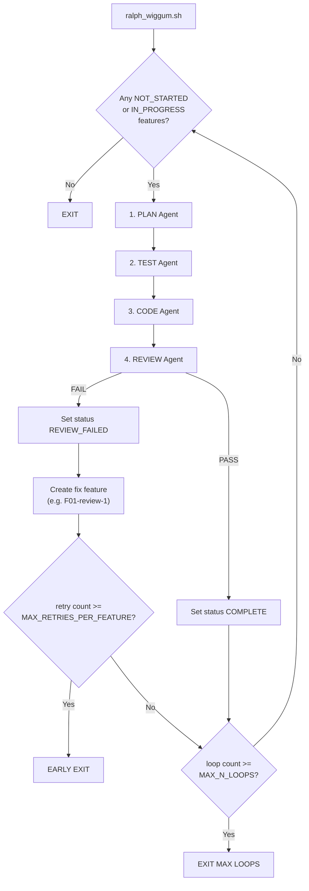

# Ralph Wiggum — Agentic Application Builder

An automated multi-agent loop for building complete applications on an isolated VM. Four specialised LLM agents (Plan, Test, Code, Review) iterate through a pre-defined feature list, communicating through shared local files and git history.

## How It Works

Prior to starting the agent loop, prepare:

1. **`README.md`** — project overview and codebase layout (this file, updated by agents as the project evolves).
2. **`docs/PRD.md`** — Product Requirements Document defining what to build and why.
3. **`docs/architecture_design.md`** — Architecture Design Document defining patterns and constraints.
4. **`features_list.json`** — ordered list of discrete features to implement, with dependencies.

Then run the loop. Each iteration cycles through four agents, each with a fresh context window:



## Agent Roles

| Agent | Role | Key Responsibility |
|-------|------|--------------------|
| **Plan** | Picks the next feature, writes an implementation plan | `docs/features/plans/<feature_id>.md` |
| **Test** | Writes failing tests from the plan (TDD red phase) | Test files, smoke tests |
| **Code** | Writes code to make tests pass (TDD green phase) | Application code, doc updates |
| **Review** | Runs full test suite, evaluates against checklist | `docs/code_reviews/<feature_id>/` |

## Running the Loop

```bash
bash ralph_wiggum.sh -l <max_loops> -r <max_retries_per_feature> -a <agent_lib>
```

| Arg | Description |
|-----|-------------|
| `-l` | Maximum loop iterations before stopping |
| `-r` | Maximum review retries per feature before early exit |
| `-a` | Agent library to use (`cursor` or `opencode`) |

**Exit codes:** `0` = all features complete, `1` = max retries exceeded (early exit), `2` = max loops reached.

## Codebase Layout

```
project_root/
├── ralph_wiggum.sh                  # Main agent loop orchestrator
├── features_list.json               # Feature backlog with statuses and dependencies
├── AGENTS.md                        # Coding standards for all agents
├── README.md                        # This file (project overview)
├── .secret/
│   └── agent_prompts/               # Prompt templates (agents must NOT read this)
│       ├── plan_agent.md
│       ├── test_agent.md
│       ├── code_agent.md
│       └── review_agent.md
├── docs/
│   ├── PRD.md                       # Product Requirements Document
│   ├── architecture_design.md       # Architecture Design Document
│   ├── features/
│   │   └── plans/                   # Implementation plans (one per feature, append-only)
│   └── code_reviews/                # Code review records (per feature, per review)
└── .current_agent_context/
    └── dev_notes.md                 # Append-only inter-agent communication log
```

## Shared Context Model

Agents share context exclusively through local files and git history:

- **`features_list.json`** — source of truth for what to work on and current status.
- **`docs/features/plans/<feature_id>.md`** — implementation plans (append-only per feature).
- **`docs/code_reviews/<feature_id>/<N>-review.md`** — code review records.
- **`.current_agent_context/dev_notes.md`** — append-only scratchpad for inter-agent notes.
- **`git log`** — commit history provides a timeline of all changes.

## Feature Status Flow

| Status | Meaning |
|--------|---------|
| `NOT_STARTED` | Queued for work |
| `IN_PROGRESS` | Currently being worked on (plan agent sets this) |
| `COMPLETE` | Review passed |
| `REVIEW_FAILED` | Review failed; a fix feature (e.g. `F01-review-1`) is created |

When a review fails, the review agent creates a new fix feature with an ID like `F01-review-1`, containing the specific required changes. The retry count for early-exit is derived from the number of `<base_id>-review-*` entries in `features_list.json`.
